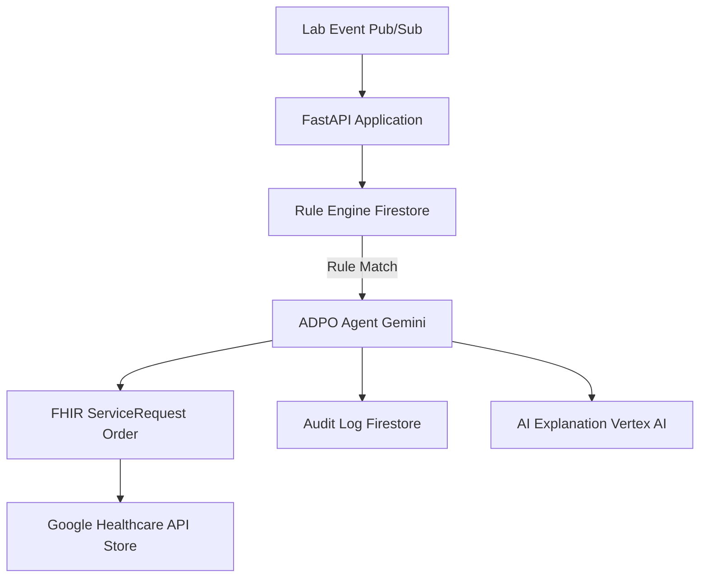

# ADPO: Autonomous Diagnostic Path Orchestrator

ADPO (Autonomous Diagnostic Path Orchestrator) is an intelligent clinical reflex orchestration system designed to bridge the gap between diagnostic results and clinical actions. By leveraging Google Cloud's Healthcare API and Gemini AI, ADPO ensures that critical laboratory findings are acted upon instantly and accurately.

---

## 🩺 The Problem Statement
In traditional clinical workflows, there is often a significant delay between a laboratory identifying an abnormal result and a clinician ordering the necessary follow-up (reflex) test. 
- **Administrative Delays:** Clinicians may not see a result for hours or days.
- **Human Error:** Critical follow-up tests can be overlooked in busy environments.
- **Inconsistency:** Reflex testing protocols may vary between practitioners.

**ADPO solves this by automating the detection and ordering of reflex tests the moment an initial lab result is recorded.**

---

## 🚀 Benefits

### For Patients
- **Faster Diagnosis:** Reduces the time to diagnosis by hours or even days.
- **Improved Safety:** Ensures that critical abnormal results (like dangerously high INR) are caught and acted upon immediately.
- **Consistent Care:** Guarantees that every patient is evaluated against the latest clinical guidelines.

### For Organizations
- **Operational Efficiency:** Reduces the administrative burden on clinicians by automating order entry.
- **Standardization:** Enforces organizational and clinical guidelines (e.g., ADA, AUA) across the entire health system.
- **Auditability:** Maintains a permanent, searchable record of every clinical decision and the guideline that justified it.
- **Interoperability:** Uses the industry-standard FHIR (Fast Healthcare Interoperability Resources) for seamless integration with modern EHRs.

---

## 🏗️ Architectural Flow


---

## 💻 Code Flow (Beginner Friendly)
1. **The Trigger:** A new lab result arrives as a message (via Google Cloud Pub/Sub).
2. **The Intake:** Our `FastAPI` app (`app.py`) catches the message and extracts the patient's data (ID, test code, value, age, gender).
3. **The Rule Check:** The system looks into a database (Firestore) to see if there is a "Reflex Rule" for that specific test (e.g., *"If Glucose > 200, order a follow-up"*).
4. **The Decision:** 
   - If the value is normal: The process stops and logs "No Action Needed."
   - If the value is abnormal: The **ADPO Agent** decides which follow-up test to order.
5. **The Action:** The system automatically creates a **ServiceRequest** (a medical order) in the clinical database (FHIR Store).
6. **The Explanation:** **Gemini AI** writes a simple, professional note explaining *why* the order was created so the doctor understands the logic immediately.
7. **The Record:** Every step is saved in an **Audit Log** for future review.

---

## 📂 Project Structure
- `adpo_agent/`: Core logic folder.
  - `agent.py`: The AI Orchestrator that coordinates between rules and actions.
  - `app.py`: The entry point (API) that receives incoming lab results.
  - `lab_rules.py`: The "brain" that checks results against clinical thresholds.
  - `fhir_client.py`: Handles communication with the Google Healthcare API.
  - `audit.py`: Manages the permanent record of all decisions.
  - `seed_rules.py`: Script to populate the database with clinical guidelines.
- `explainer.py`: Uses Gemini to generate human-readable explanations.
- `streamlit_app.py`: A visual dashboard for monitoring lab results and orders.

---

## 🛠️ Prerequisites & Dependencies
- **Python:** 3.12+
- **Google Cloud Project:** With the following APIs enabled:
  - Healthcare API (FHIR Store)
  - Firestore (Native Mode)
  - Vertex AI (for Gemini)
  - Pub/Sub
- **Environment Variables:** `PROJECT_ID` must be set.

**Key Dependencies:**
- `google-adk`: For building AI-powered agents.
- `google-cloud-firestore`: For rule storage and auditing.
- `google-cloud-aiplatform`: For Gemini (Vertex AI).
- `fastapi`: For the web server.
- `streamlit`: For the monitoring dashboard.

---

## 🏃 How to Run

### 1. Install Dependencies
```bash
pip install -r requirements.txt
```

### 2. Set Up Environment
```bash
export PROJECT_ID="your-google-cloud-project-id"
```

### 3. Seed Clinical Rules
Populate Firestore with sample reflex rules:
```bash
python -m adpo_agent.seed_rules
```

### 4. Start the API
```bash
uvicorn adpo_agent.app:app --reload
```

### 5. Start the Monitoring Dashboard
```bash
streamlit run streamlit_app.py
```
